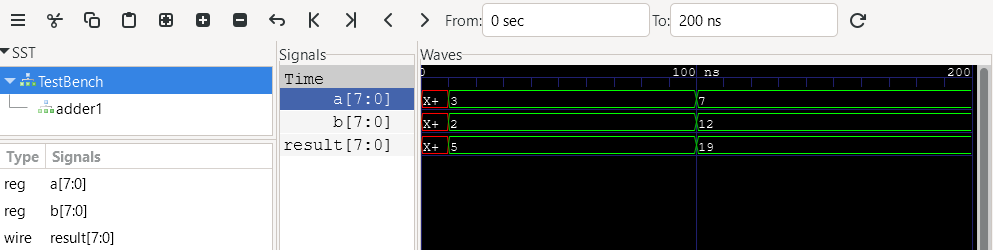
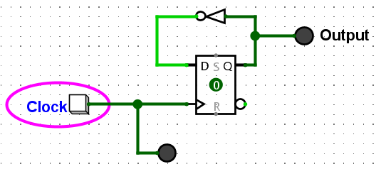
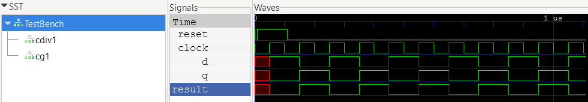
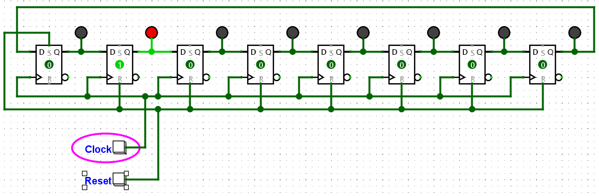
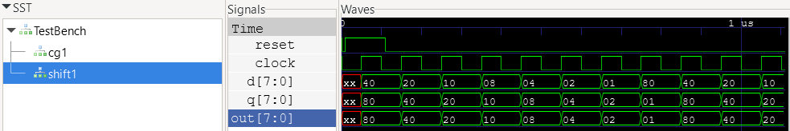
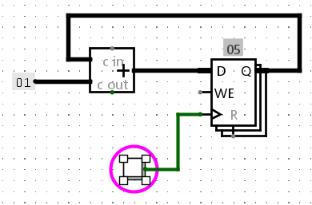
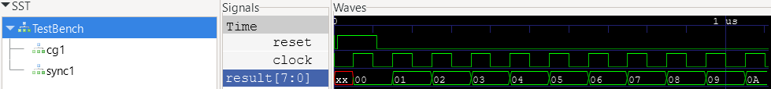

# Foundations

Logic design can be divided into two broad categories:

1. Combinational logic
2. Sequential logic

Combinational logic is made of well known boolean gates such as AND, OR, XOR, NOT, NAND, NOR etc. Combinational logic is *asynchronous*, meaning the output of combinational logic changes directly in response to any input, it has no memory. In practice some small propagation delay is present, typically on the order of nanoseconds depending on logic family, output load, supply voltage, etc.

Combinational logic can be used exclusively to implement many types of computation, such as addition, subtraction, and even multiplication. In fact all of these types of computation can be built using exclusively NAND or NOR gates.

Sequential logic is *synchronous*, meaning the outputs change in response to the inputs *and* distinct clock signal. Sequential logic has memory, meaning it can maintain state or change state under specific control. Simple sequential logic can be used to build counters, shift registers, or transfer values from one register to another. This last operation is of particular interest when building more complex logical systems, such as CPUs.

In practice, combinational and sequential logic are used together to build arbitrarily complex systems. Much of the abstract [automata theory](https://en.wikipedia.org/wiki/Automata_theory) was developed in the mid 20th century by giants such as [Claude Shannon](https://en.wikipedia.org/wiki/Claude_Shannon), [Edward F. Moore](https://en.wikipedia.org/wiki/Edward_F._Moore), [George H. Mealy](https://en.wikipedia.org/wiki/George_H._Mealy), and of course [Alan Turing](https://en.wikipedia.org/wiki/Alan_Turing), among many others. The formal theory can appear mathematically dense, but it's conceptually simple.

## Tools

* [Logisim Evolution](https://github.com/logisim-evolution/logisim-evolution) - graphical logic simulation
* [OSS Cad Suite](https://github.com/YosysHQ/oss-cad-suite-build) - an excellent collection of open source FPGA simulation and synthesis tools

## Combinational Logic

A [full adder](https://en.wikipedia.org/wiki/Adder_(electronics)) adds two input bits, a carry in and produces one output bit and a carry out. Full adders can be wired in cascade to add or subtract arbitrarily wide integers. A simple ripple carry adder feeds the carry out of the previous stage to the carry in of the next stage. This works, but suffers from long carry propagation delays which limits performance. [Look ahead carry](https://en.wikipedia.org/wiki/Lookahead_carry_unit) is commonly used to improve computational speed. Modern FPGAs contain logic to automagically synthesize look ahead carry, so there's no need to code it yourself.

[Adder.v](Verilog/Adder.v) contains a simple Verilog adder module, mostly as a syntax reference. The included makefile is used to run simulation using [Icarus Verilog](https://en.wikipedia.org/wiki/Icarus_Verilog), which is conveniently included in [OSS Cad Suite](https://github.com/YosysHQ/oss-cad-suite-build).

The following commands will run simulation:

```
md vcd # one time only
make adder
```

[GTKWave](https://gtkwave.sourceforge.net/) is an open source wave viewer capable of reading vcd files created by Icarus Verilog, also included in OSS Cad Suite. Start gtkwave and open vcd/TestBench.vcd. After adding some available signals from the left panel, you might see something like this:



Notice the red X values where signals are undefined. Undefined signals should be avoided.

There are multiple ways this could have been written, but for consistency, the combinational always block is used here:

```
    always @(*) begin
        result = a + b;
    end
```

The ```@(*)``` in Verilog specifies all signals are included in the *sensitivity list*, which can be interpreted as combinational logic. If any signal changes, the always block executes.

## Sequential Logic

Let's start with a one bit storage element known as a [D-type flip flop](https://en.wikipedia.org/wiki/Flip-flop_(electronics)#D_flip-flop). For the purposes of this discussion, a D-type flip flop is *edge-triggered* meaning the outputs can only change after the rising edge of the clock input. In modern designs, a common, fixed rate clock controls when outputs change. This wasn't always the cases, but it's generally easier to analyze the performance bounds of a system if the clock rate is fixed. Modern tools greatly simplify analysis of what was tediously done by hand. For these reasons, we will focus on single clock, synchronous designs.

### First Example

A basic clock divider is easily built using a flip flop and an inverter, pictured below.



The [logisim divider](logisim/Clock_divider.circ) is available for experimentation. Notice the output only changes when the input button is pressed during simulation (use the finger tool to press the button). A button press simulates the rising edge of the clock. The Q output of the D flip flop takes the value of the D input just after the rising edge of the clock. The datasheet for discrete flip flops list the minimum and maximum propagation delay from clock to Q output. Similarly, there are setup of hold times for the D input. For the D flip flop to operate correctly, the D input must be stable before the setup time and after the hold time relative to the clock. These values plus propagation delays define the upper bound of the clock frequency.

The [Verilog equivalent](Verilog/ClockDivider.v) introduces the sequential always block, executing only on the positive edge of the clock:

```
    always @(posedge clock) begin
        if (reset == 1) begin
            q <= 0;
        end else begin
            q <= ~q;
        end
    end
```

When modeling sequential logic, it is critical to use non-blocking assignments ( <= ). Non-blocking assignments calculate all the right-hand sides of the equations at the beginning of a time step and update the left-hand sides at the end. This correctly models the simultaneous behavior of hardware registers changing state on a clock edge. VHDL is much more consistent in this regard, so many engineers avoid Verilog for this reason.

The simulation waveform is as expected. Notice undefined values prior to reset, which illustrates why reset is needed:



### Shift Register

Shift registers are commonly used in RS-232, USB, and many other serial interfaces. They can translate a parallel word into a serial bitstream and vice-versa. A [circular shift](logisim/Shift_register.circ) register is pictured below:



This is where a common source of confusion comes in. It would seem like the input of each D flip flop in the shift register is changing at the same time as the clock, resulting in a race condition, but that's not exactly true. In practice, the clock to Q propagation delay is greater than the D to clock setup time. It's a natural result of how flip flops are designed. In fact, a discrete master slave flip flop would behave the same way. It means that the D input will always be setup and stable before the rising edge of the clock. This is a critical insight for any type of sequential logic. If you can grok that concept, you are well on your way.

And the [Verilog equivalent](Verilog/ShiftRegister.v).

The simulation waveform is as expected. Notice undefined values prior to reset, which illustrates why reset is needed:



### Synchronous Counter

Below is a diagram of a [synchronous counter](logisim/Sync_counter.circ):



The 8-bit register is a simply a set of D flip flops wired in parallel rather than serial. The clock inputs are all connected together, making is synchronous. The alternative is a [ripple counter](https://www.geeksforgeeks.org/digital-logic/ripple-counter-in-digital-logic/). Ripple counters suffer from propagation delays among other things. They are simpler to build but can be significantly slower than synchronous counters. The clock rate of a synchronous counter is bounded by the propagation delay of the adder, which can be relatively fast if lookahead carry is used. Another benefit is that all outputs change at the same time, which is not true for a ripple counter.

And the [Verilog equivalent](Verilog/ShiftRegister.v). The logic is only slightly different than the shift register. This illustrates the power of HDLs for large scale logic design. A wider counter would require only a simple change to the register width.

The simulation waveform is as expected. Notice undefined values prior to reset, which illustrates why reset is needed:


