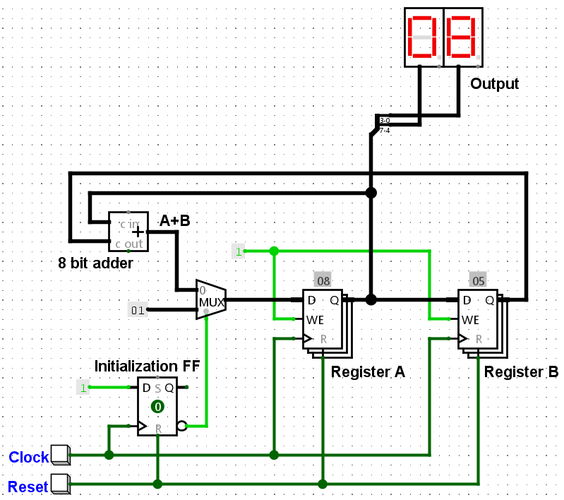
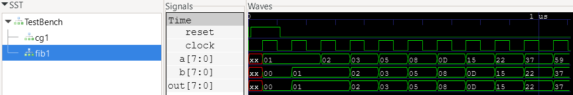

# Foundations

Logic design can be divided into two broad categories:

1. Combinational logic
2. Sequential logic

Combinational logic is made of well known boolean gates such as AND, OR, XOR, NOT, NAND, NOR etc. Combinational logic is *asynchronous*, meaning the output of combinational logic changes directly in response to any input, it has no memory. In practice some small propagation delay is present, typically on the order of nanoseconds depending on logic family, output load, supply voltage, etc.

Combinational logic can be used exclusively to implement many types of computation, such as addition, subtraction, and even multiplication. In fact all of these types of computation can be built using exclusively NAND or NOR gates. As a practical example, the [Apollo Guidance Computer](https://en.wikipedia.org/wiki/Apollo_Guidance_Computer) was built entirely using about 4100 three-input NOR gates.

Sequential logic is *synchronous*, meaning the outputs change in response to the inputs *and* a distinct clock signal. Sequential logic has memory, meaning it can maintain state or change state under specific control. Simple sequential logic can be used to build counters, shift registers, or transfer values from one register to another. This last operation is of particular interest when building more complex logical systems, such as CPUs.

In practice, combinational and sequential logic are used together to build arbitrarily complex systems. Much of the abstract [automata theory](https://en.wikipedia.org/wiki/Automata_theory) was developed in the mid 20th century by giants such as [Claude Shannon](https://en.wikipedia.org/wiki/Claude_Shannon), [Edward F. Moore](https://en.wikipedia.org/wiki/Edward_F._Moore), [George H. Mealy](https://en.wikipedia.org/wiki/George_H._Mealy), and of course [Alan Turing](https://en.wikipedia.org/wiki/Alan_Turing), among many others. The formal theory can appear mathematically dense, but it's conceptually simple.

Unfortunately, most treatments of logic design explain combinational logic well, but either fall apart or over theorize when it comes to sequential design. Following a few straightforward, consistent practices results in predictable, high performance designs that are easy to maintain. This is an attempt to document practices I follow that have worked well for me. It starts simple, only assuming basic knowledge of logic gates and binary arithmetic.

## Tools

* [Logisim Evolution](https://github.com/logisim-evolution/logisim-evolution) - graphical logic simulation
* [OSS Cad Suite](https://github.com/YosysHQ/oss-cad-suite-build) - an excellent collection of open source FPGA simulation and synthesis tools

## Combinational Logic

A [full adder](https://en.wikipedia.org/wiki/Adder_(electronics)) adds two input bits, a carry in and produces one output bit and a carry out. Full adders can be wired in cascade to add or subtract arbitrarily wide integers. A simple ripple carry adder feeds the carry out of the previous stage to the carry in of the next stage. This works, but suffers from long carry propagation delays which limits performance. [Look ahead carry](https://en.wikipedia.org/wiki/Lookahead_carry_unit) is commonly used to improve computational speed. Modern FPGAs contain logic to automagically synthesize look ahead carry, so there's no need to code it yourself.

[Adder.v](Verilog/Adder.v) contains a simple Verilog adder module, mostly as a syntax reference. The included makefile is used to run simulation using [Icarus Verilog](https://en.wikipedia.org/wiki/Icarus_Verilog), which is conveniently included in [OSS Cad Suite](https://github.com/YosysHQ/oss-cad-suite-build).

The following commands will run simulation:

```
md vcd # one time only
make adder
```

[GTKWave](https://gtkwave.sourceforge.net/) is an open source wave viewer capable of reading vcd files created by Icarus Verilog, also included in OSS Cad Suite. Start gtkwave and open vcd/TestBench.vcd. After adding some available signals from the left panel, you might see something like this:


Notice the red X values where signals are undefined. Undefined signals should be avoided.

There are multiple ways this could have been written, but for consistency, the combinational always block is used here:

```
    always @(*) begin
        result = a + b;
    end
```

The ```@(*)``` in Verilog specifies all signals are included in the *sensitivity list*, which can be interpreted as combinational logic. If any signal changes, the always block executes.

## Sequential Logic

Let's start with a one bit storage element known as a [D-type flip flop](https://en.wikipedia.org/wiki/Flip-flop_(electronics)#D_flip-flop). For the purposes of this discussion, a D-type flip flop is *edge-triggered* meaning the outputs can only change after the rising edge of the clock input. In modern designs, a common, fixed rate clock controls when outputs change. This wasn't always the cases, but it's generally easier to analyze the performance bounds of a system if the clock rate is fixed. Modern tools greatly simplify analysis of what was once tediously done by hand. For these reasons, we will focus on single clock, synchronous designs.

### First Example

A basic clock divider is easily built using a flip flop and an inverter, pictured below.


The [logisim divider](logisim/Clock_divider.circ) is available for experimentation. Notice the output only changes when the input button is pressed during simulation (use the finger tool to press the button). A button press simulates the rising edge of the clock. The Q output of the D flip flop takes the value of the D input just after the rising edge of the clock. The datasheet for discrete flip flops list the minimum and maximum propagation delay from clock to Q output. Similarly, there are setup of hold times for the D input. For the D flip flop to operate correctly, the D input must be stable before the setup time and after the hold time relative to the clock rising edge. These values plus propagation delays define the upper bound of the clock frequency.

The [Verilog equivalent](Verilog/ClockDivider.v) introduces the sequential always block, executing only on the positive edge of the clock:

```
    always @(posedge clock) begin
        if (reset == 1) begin
            q <= 0;
        end else begin
            q <= d;
        end
    end
```

When modeling sequential logic, it is critical to use non-blocking assignments ( <= ). Non-blocking assignments calculate all the right-hand sides of the equations at the beginning of a time step and update the left-hand sides at the end. This correctly models the simultaneous behavior of hardware registers changing state on a clock edge. VHDL is much more consistent in this regard, so many engineers avoid Verilog for this reason.

The combinational always block performs the NOT (inversion) operation from q to d, just like the schematic above:

```
    always @(*) begin
        d = ~q;
    end
```

This could have been done in the sequential always block, but this explicit form is used to more closely align with the schematic.

The simulation waveform is as expected. Notice undefined values prior to reset, which illustrates why reset is needed:


### Shift Register

Shift registers are commonly used in RS-232, USB, and many other serial interfaces. They can translate a parallel word into a serial bitstream and vice-versa. A [circular shift](logisim/Shift_register.circ) register is pictured below:


This is where a common source of confusion comes in. It would seem like the input of each D flip flop in the shift register is changing at the same time as the clock, resulting in a race condition, but that's not exactly true. In practice, the clock to Q propagation delay is greater than the required D hold time after the clock edge. Often, the [hold time is zero](https://www.ti.com/lit/ds/symlink/sn74hc74.pdf). It's a natural result of how flip flops are designed. In fact, a discrete master slave flip flop made from NAND gates or even individual transistors would behave the same way. It means that the D input will always be sufficiently stable before and after the rising edge of the clock. This is a critical insight for any type of sequential logic. If you can grok that concept, you are well on your way. Of course setup time must be met, which limits the clock rate.

The [Verilog equivalent](Verilog/ShiftRegister.v) contains this wiring code:

```
d = { q[0], q[7:1] };
```

You can guess what's happening, which is the same as the wiring in logisim equivalent above. Comma separated values within curly braces represent concatenation in Verilog.

The simulation waveform is as expected. Notice undefined values prior to reset, which illustrates why reset is needed:


### Synchronous Counter

Below is a diagram of a [synchronous counter](logisim/Sync_counter.circ):


The 8-bit register is a simply a set of D flip flops with all clock inputs connected together, making it synchronous just like the shift register above. The output of the register is fed back to the input through an 8-bit adder. The other input to the adder is set to a constant value of one. On each rising edge of the clock, the register output takes on the previous value plus one. Setting the constant to some other value, such as -1 (all ones in 2's complement form) turns this into a down counter. HDL synthesizers will automatically minimize add by a constant logic, which was done by hand back in the day. The internal logic of the [74HC161](https://www.ti.com/lit/ds/symlink/sn74hc161.pdf) is more or less implemented this way.

The alternative is a [ripple counter](https://www.geeksforgeeks.org/digital-logic/ripple-counter-in-digital-logic/). Ripple counters suffer from propagation delays among other things. They are simpler to build but can be significantly slower than synchronous counters. The clock rate of a synchronous counter is bounded by the propagation delay of the adder, which can be very fast if lookahead carry is used. Another benefit is that all outputs change at the same time, which is not true for a ripple counter.

And the [Verilog equivalent](Verilog/SyncCounter.v). The logic is only slightly different than the shift register. This illustrates the power of HDLs for large scale logic design. A wider counter would require only a simple change to the register width.

The simulation waveform is as expected. Notice undefined values prior to reset, which illustrates why reset is needed:


### Fibonacci Sequence

The [Fibonacci sequence](https://en.wikipedia.org/wiki/Fibonacci_sequence) is an infinite sequence where each value is the sum of the two previous values like this:

```
0, 1, 1, 2, 3, 5, 8...
```

The equivalent, iterative Python code looks like this:

```
a = 1
b = 0
for i in range(10):
    print(b)
    sum = a + b
    b = a
    a = sum
```

Below is a diagram of a [Fibonacci calculator](logisim/Fibonacci.circ) in hardware:



There are two 8-bit registers representing the variables "a" and "b" in the Python code above. The third register is for initialization, which selects the 8-bit value 1 during the first clock cycle after reset and sum of a and b for all subsequent cycles. This is achieved using an 8-bit multiplexer, which selects one of two values depending on the select input. Multiplexers are commonly used to route inputs to registers.

For each clock cycle, the a and b registers update simultaneously in parallel. This demonstrates the parallelism that can be achieved in hardware that often implemented serially in software. The next value can be computed in one cycle, which would typically require several cycles in software.

The [Verilog equivalent](Verilog/Fibonacci.v) is very similar to the previous examples, with the addition of another register. Each register bit generally maps to one logic element (LE) or configurable logic block (CLB) in an FPGA. Small FPGAs might contain about [1000 logic elements](https://www.latticesemi.com/en/Products/FPGAandCPLD/iCE40), while the largest can contain over [one million LEs](https://www.altera.com/products/fpga/stratix/10/gx). That gives you an idea how much logic you can fit into a given FPGA. FPGAs contain many other resources, such as block RAM, multiplier cores, high speed serial interfaces for performance and improved resource utilization. We'll use some of those resources later.

Unlike the software example in Python, these two lines in the Verilog sequential block could be written in either order, the result is the same:

```
a <= sum;
b <= a;
```

or

```
b <= a;
a <= sum;
```

In both cases, the outputs of the registers take on the values of their inputs on the rising edge of the clock. Since their input values are already defined and stable prior to the clock edge, the order of these two statements does not matter. Even though Hardware Description Languages (HDLs) look like software code, they behave differently. HDLs model state changes over time in response to changing inputs, simulating the parallel nature of real hardware. Software is generally sequential in nature, which makes it much easier to develop and reason about. Once you grasp the fundamental difference, it's easy to go back and forth between software and HDLs.

The simulation waveform is as expected. Notice undefined values prior to reset, which illustrates why reset is needed:



Notice the output of register b is the same as register a delayed by one clock cycle. It's an example of [pipelining](https://en.wikipedia.org/wiki/Pipeline_(computing)), which is common in hardware designs. It's like an assembly line where different operations are performed in parallel.

### A Simple CPU

In his 1948 essay, "Intelligent Machinery", Alan M. Turing described a [universal computing machine](https://en.wikipedia.org/wiki/Turing_machine) consisting of an unlimited memory capacity obtained in the form of an infinite tape. This theoretical machine also contained a rulebook or set of instructions to direct the machine to move a read/write head left or right, read or write a symbol at the current location, and test the value of a symbol at the current location. Turing showed that these simple operations, while plodding and slow by modern standards, are all that are needed for universal computation. In fact, it's so simple that any machine that contains these minimal operations in any form is computationally equivalent and are called [Turing Complete](https://en.wikipedia.org/wiki/Turing_completeness). The video below is a physical model of a Turing machine for demonstration purposes:


[Video](https://www.youtube.com/watch?v=E3keLeMwfHY)

Strictly speaking, modern CPUs are [Linear Bounded Automatons](https://en.wikipedia.org/wiki/Linear_bounded_automaton) due to finite memory. For practical purposes, they are usually called Turing Complete, meaning they are all equivalent in computation capability. We intuitively know that a 6502 from 1976 can do anything that a modern multi-core Pentium can do today, although not nearly as fast!

Given this simple model, it's actually very easy to make a Turing complete CPU. All it requires is random access memory (a tape), a few basic operations (read, write, test, jump), and a rulebook describing operations to be executed in sequence (instructions). All of this can be built up using the primitives developed earlier. The diagram below illustrates the relationship between the simplest automata (combinational logic) and the most complex (Turing machines).


 The counter, shift register, and Fibonacci calculator above were all [finite state machines](https://en.wikipedia.org/wiki/Finite-state_machine), meaning they simply move from one state to another based on fixed logic. They are not capable of reading and executing instructions from a rulebook. Still, they can be surprisingly powerful. In fact, early video games such as [Atari Pong](https://www.arcade-museum.com/manuals-videogames/P/PongSchematics.pdf) were sophisticated state machines made from discrete TTL logic, no microprocessor involved! Memory in those days was expensive, so state machines made economic sense in these applications.

We will skip over the [pushdown automaton](https://en.wikipedia.org/wiki/Pushdown_automaton) as it's not relavent to our goals here, but I encourage you to learn about it. It's a facinating subject.

Stay tuned!

## Verilog Best Practices

Verilog can be unforgiving and confusing, which is why some engineers prefer VHDL. VHDL symantics are superior in my opinion, but tends to be more syntactically verbose. Here are some best practices to avoid common problems.

1. Avoid [combinational loops](https://vlsi-soc.blogspot.com/2013/05/combinational-loops.html). Hardware design is not like software. You should not assign a register to itself (or some combination version of itself) in a combinational block. It can lead to non-deterministic behavior. There are some unusual cases where they might be useful, but in general, it's not what you want.

2. Use ```=``` for assignment in combinational (```always @(*)```) blocks. Conversely, use ```<=``` for assignment in sequential blocks (```always @(posedge clock)```).

3. I prefer to use one combinational block and one sequential block in each module. You don't have to do it this way, but I prefer to keep things simple and consistent.
