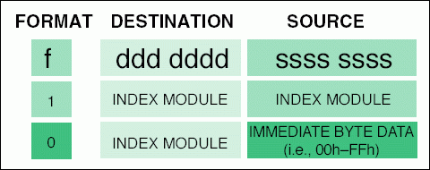
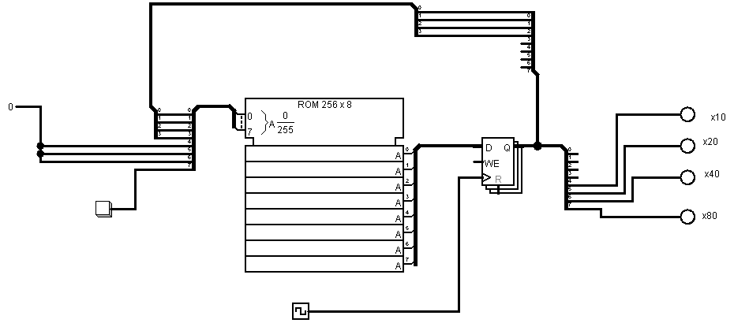

# logisim_evo
A collection of [Logisim Evolution](https://github.com/logisim-evolution/logisim-evolution) circuits.

Logisim Evolution is an excellent, open source graphical logic simulator.

This repo includes an [Ultimate RISC](https://en.wikipedia.org/wiki/One_instruction_set_computer), or One Instruction Set Computer. More specifically, this is a [Transport Triggered Architecture](https://en.wikipedia.org/wiki/Transport_triggered_architecture) (TTA) that only supports the MOVE instruction. The design was influenced by the [Maxim MAXQ](https://www.maximintegrated.com/en/app-notes/index.mvp/id/3222) processor.

This is a 16 bit Harvard architecture processor with independent program and data memory. Every instruction executes in a single cycle.

The processor includes a clever prefix register, an idea borrowed from the MAXQ. Writing an immediate value to register zero loads the prefix register. The value in the prefix register is used as the upper 8 bits of an operand. The value of the prefix register is available for one cycle only, it immediately resets to zero after it is read.

In addition, a simple traffic light controller is implemented as a [Moore state machine](https://en.wikipedia.org/wiki/Moore_machine).

